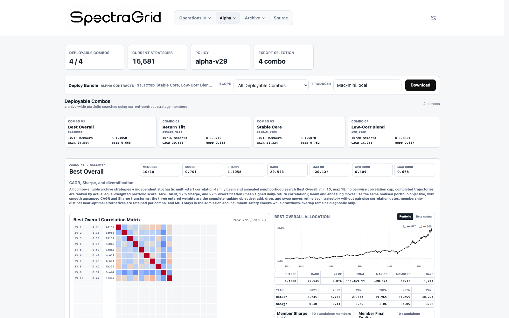
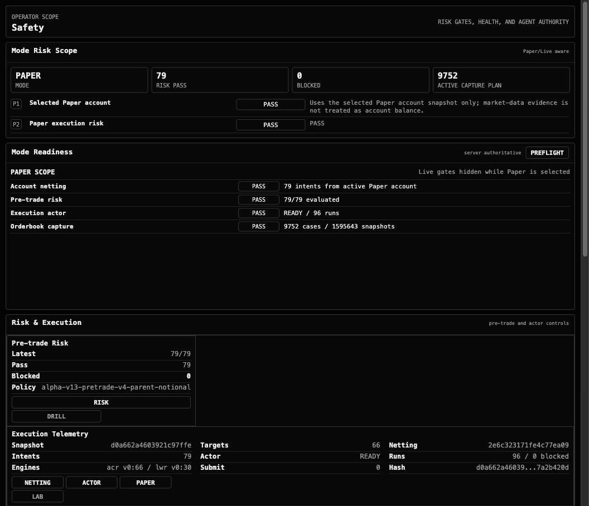
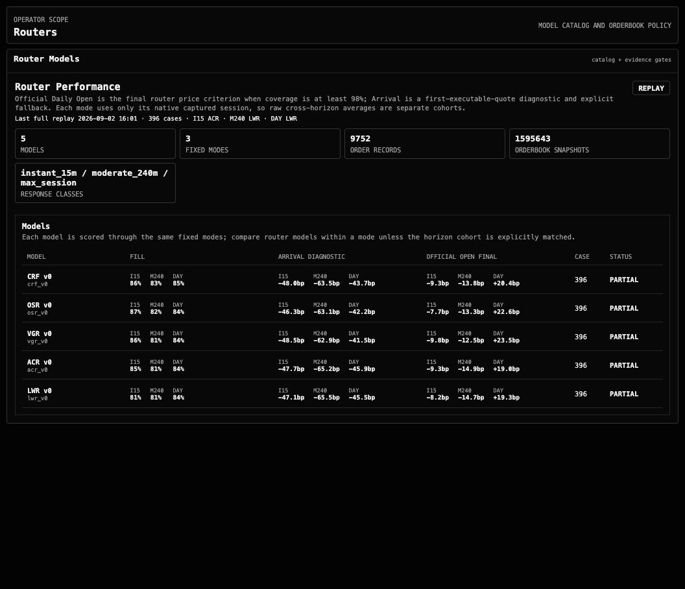
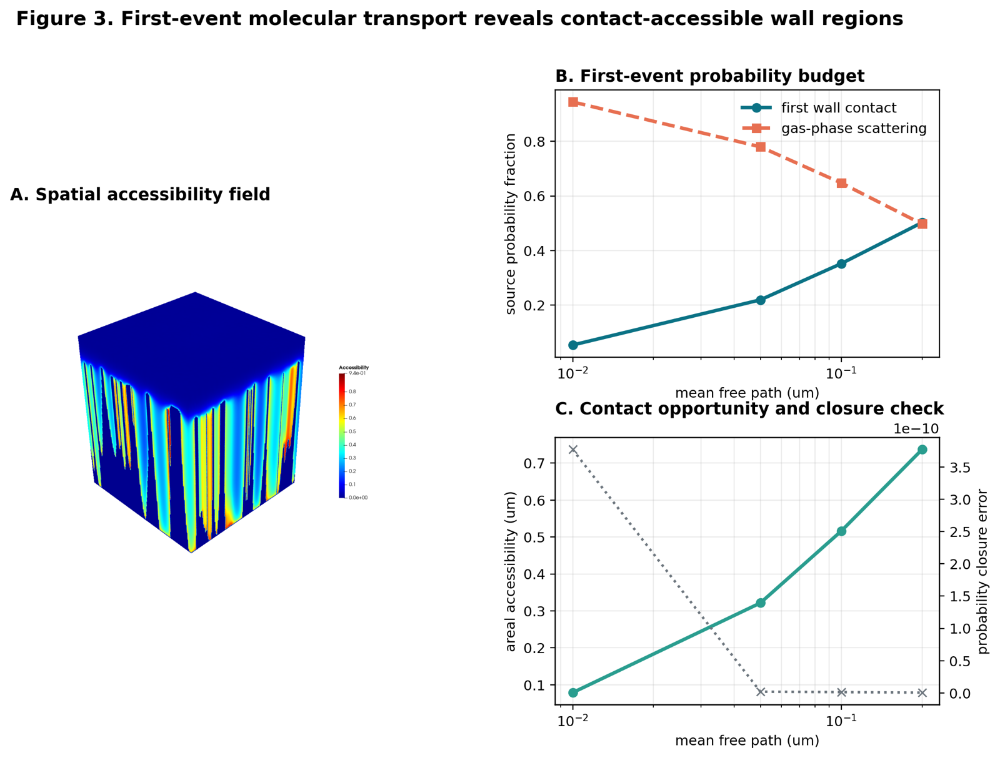

  <a href="#the-shortlist">THE SHORTLIST</a> ·
  <a href="#capital-engine">CAPITAL ENGINE</a> ·
  <a href="#execution-moat">EXECUTION MOAT</a> ·
  <a href="#deep-tech-ip">DEEP-TECH IP</a> ·
  <a href="#leverage-layer">LEVERAGE LAYER</a>

<h1 align="center">codeshark94</h1>

  <strong>Build the edge. Prove the boundary. Compound the workflow.</strong> 
  Local-first systems where technical distinctiveness has a path to economic value.

  <code>capital systems</code> · <code>scientific IP</code> · <code>local execution</code> · <code>evidence before automation</code>

## The shortlist

This profile is intentionally selective: three projects with a clear technical moat and a concrete economic mechanism, plus the local execution layer that makes the work compound. The evidence is real; the upside is framed as a thesis, not as realized revenue or live-trading performance.

<table>
  <tr>
    <td width="50%"><strong>01 / CAPITAL</strong> find and package an edge</td>
    <td width="50%"><strong>02 / CONTROL</strong> make deployment expensive to get wrong</td>
  </tr>
  <tr>
    <td width="50%"><strong>03 / IP</strong> turn raw measurement into a moat</td>
    <td width="50%"><strong>04 / LEVERAGE</strong> repeat the whole loop locally</td>
  </tr>
</table>

## Capital engine

### 01 / Explore — [SpectraGrid](https://github.com/codeshark94/SpectraGrid)

SpectraGrid turns open-ended market questions into inspectable research artifacts: deterministic strategy generation, point-in-time backtests, archive context, correlation-aware portfolio selection, and exportable implementation contracts. The local dashboard keeps the path visible as **Operations → Alpha → Archive → Source**.

  

Fresh local Alpha Lab capture · 2026-09-03 · 4/4 deployable combinations · 15,581 current strategies · alpha-v29 policy.

**Economic mechanism:** convert research time into reusable, cost-aware portfolio candidates instead of one-off charts. The displayed state is an archived backtest snapshot; a separate forward paper run is monitored as its own evidence stream.

## Execution moat

### 02 / Guard — [MARF](https://github.com/codeshark94/MARF)

MARF is the operator-facing handoff between research evidence and execution. Account state, pre-trade risk, execution authority, market-session evidence, and orderbook capture remain separate gates. Paper is the default research surface; live writes stay blocked until the protocol explicitly allows them.

  

Safety: risk, readiness, and authority stay visible in Paper scope.

  

Router replay: 5 models · 3 fixed modes · 1,595,643 orderbook snapshots; partial coverage remains explicit.

Fresh local console captures · 2026-09-03 · broker-write-free research workflow.

**Economic mechanism:** reduce the cost of operational mistakes while making execution quality measurable. MARF is not a fire-and-forget bot; its value is a control plane that makes uncertainty visible before capital can cross a write boundary.

## Deep-tech IP

### 03 / Measure — [FETM-NanoWall](https://github.com/codeshark94/FETM-NanoWall)

FETM-NanoWall turns SEM imagery into a calibrated metric nano-domain, voxelizes the reconstructed geometry, and computes first-event transport and wall-contact fields for scientific inspection.

  

Current transport output: spatial accessibility, first-event probability, and contact closure.

  

Current KWFS sweep: particle collision rate versus kinetic contact rate across λ.

**Economic mechanism:** a defensible measurement and simulation asset for materials and process decisions where a micrograph alone is not enough. The chain stays inspectable from calibration → geometry → voxel transport → post-processing; current evidence supports a research pipeline, not a commercial-performance claim.

## Leverage layer

### 04 / Compound — [Codeshark](https://github.com/codeshark94/codeshark)

Codeshark is the local operating layer around Codex: project routing, persistent context, task execution, verification, and result delivery. It keeps sensitive work on the Mac while turning a finished task into a repeatable unit with a concrete project, a minimal change, fresh evidence, and a clear handoff.

**Economic mechanism:** operator leverage. The same local control plane can carry research, engineering, validation, and delivery across the three systems above without turning private project state into a hosted dependency.

## Evidence policy

| Boundary | What I keep separate |
| --- | --- |
| Finance | backtest archive ≠ forward paper run ≠ live performance |
| Execution | replay diagnostics ≠ broker fills; acknowledgement ≠ acceptance |
| Science | reconstructed field ≠ theorem; simulation ≠ measurement |
| Automation | a ready-looking interface ≠ verified downstream behavior |

Selected visuals are fresh local captures or current project outputs. Every screenshot is evidence of a surface or run state, not a promise beyond what it shows.

