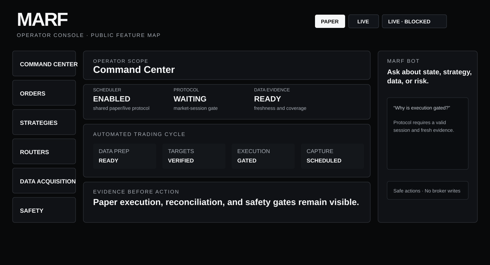
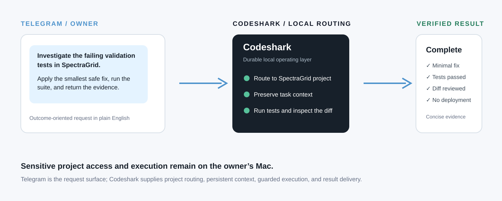

  <a href="#quant-lab">QUANT LAB</a> ·
  <a href="#operator-console">OPERATOR CONSOLE</a> ·
  <a href="#agent-workflow">AGENT WORKFLOW</a> ·
  <a href="#scientific-computing">SCIENTIFIC COMPUTING</a>

<h1 align="center">codeshark94</h1>

  <strong>Building trustworthy autonomous systems.</strong> 
  Local-first systems for quant research, guarded operations, scientific computing, and durable AI task execution.

  <code>Local-first</code> · <code>Evidence before automation</code> · <code>Reproducible research</code> · <code>Guarded execution</code>

## Quant Lab

### [SpectraGrid](https://github.com/codeshark94/SpectraGrid) — from open-ended ideas to audited alpha portfolios

SpectraGrid turns hypotheses into deterministic backtests, preserves the evidence in an archive, and assembles complementary candidates into deployable Alpha portfolios. Its interface keeps the research path visible: **Operations → Alpha → Archive → Source**.

  

Return Tilt is a maintainer research-archive snapshot as of 2026-07-22. Historical backtest results only; not investment advice or live results.

| Deployable combo | Members | Sharpe | CAGR | Max correlation |
| --- | ---: | ---: | ---: | ---: |
| Best Overall | 18 / 18 | 1.3689 | 24.06% | 0.699 |
| Return Tilt | 16 / 16 | 1.2649 | 27.81% | 0.803 |
| Stable Core | 18 / 18 | 1.3823 | 22.08% | 0.744 |
| Low-Corr Blend | 19 / 20 | 1.4289 | 19.63% | 0.622 |

The point is not a single equity curve. Every candidate carries a fixed research contract, archive context, allocation rationale, and deployment boundary.

## Operator Console

### MARF — evidence-gated research operations

MARF (Micro-Adaptive Router Factory) receives strategy evidence from the research layer and makes the hand-off operationally explicit. The console is deliberately dense: it exposes status rather than hiding uncertainty.

  

| Console surface | What it makes explicit |
| --- | --- |
| Command Center | scheduler, protocol state, blockers, and readiness |
| Orders / Strategies / Routers | intent, strategy provenance, and execution-policy research |
| Data Acquisition | capture coverage and replay evidence |
| Safety | live-readiness prerequisites and the write gate |
| MARF Bot | safe, broker-write-free questions about runtime state, risk, and selected symbols |

Public diagram intentionally uses representative non-account data. Live trading remains gated by explicit safety, reconciliation, and operator-intent checks.

## Agent Workflow

### [Codeshark](https://github.com/codeshark94/codeshark) — give the outcome; keep the work on your Mac

Codeshark is the durable local operating layer around Codex: project routing, persistent context, task execution, verification, and result delivery. A request can start in Telegram in plain English while the project and sensitive work stay local.

  

The example is illustrative and deliberately sanitized. The useful unit is a finished task with an explicit project, a minimal change, verification evidence, and a clear result.

## Scientific Computing

### [FETM-NanoWall](https://github.com/codeshark94/FETM-NanoWall) — image-derived geometry to first-event transport

FETM-NanoWall reconstructs metric graphene-nanowall geometry from SEM imagery, voxelizes the domain, and computes geometry-driven transport and wall-flux fields for scientific inspection.

  
  

---

  I build systems where autonomy is paired with evidence, reproducibility, and operational discipline.

