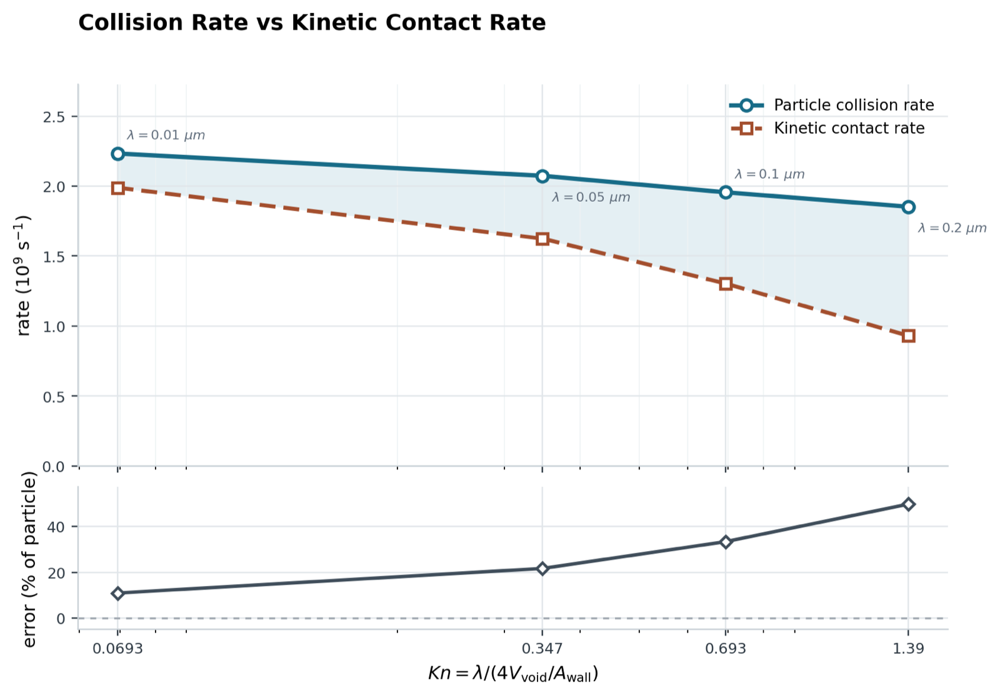

  <a href="#the-common-thread">THREAD</a> ·
  <a href="#embodied-intelligence">SOMA</a> ·
  <a href="#capital-systems">CAPITAL</a> ·
  <a href="#scientific-computing">SCIENCE</a> ·
  <a href="#mathematical-discovery">MATH</a>

<h1 align="center">codeshark94</h1>

  <strong>I build systems where intelligence has to survive contact with reality.</strong> 
  Working across embodied AI, scientific computing, mathematical discovery, capital systems, and local agent infrastructure.

  <code>sense</code> → <code>structure</code> → <code>stress-test</code> → <code>act</code> → <code>remember</code>

## The common thread

The domains change. The question does not: **how does a messy observation become a decision you can inspect, replay, and trust?**

<table>
  <tr>
    <th>Domain</th>
    <th>Question → system</th>
  </tr>
  <tr>
    <td><strong>Embodied intelligence</strong></td>
    <td>Can an AI perceive, remember, and act through a body without losing its boundaries? → <a href="https://github.com/codeshark94/SOMA">SOMA</a></td>
  </tr>
  <tr>
    <td><strong>Capital systems</strong></td>
    <td>Can uncertain evidence become a controlled decision at an economic boundary? → <a href="https://github.com/codeshark94/FONA">FONA</a> → <a href="https://github.com/codeshark94/SpectraGrid">SpectraGrid</a> → <a href="https://github.com/codeshark94/MARF">MARF</a></td>
  </tr>
  <tr>
    <td><strong>Scientific computing</strong></td>
    <td>Can an image become a reproducible physical model rather than a persuasive picture? → <a href="https://github.com/codeshark94/FETM-NanoWall">FETM-NanoWall</a></td>
  </tr>
  <tr>
    <td><strong>Mathematical discovery</strong></td>
    <td>Can search produce falsifiable candidates without confusing them with proof? → <a href="https://github.com/codeshark94/mathematical-inequality-search-platform">AISIS</a></td>
  </tr>
  <tr>
    <td><strong>Local AI infrastructure</strong></td>
    <td>Can high-context work stay private, durable, and verifiable? → <a href="https://github.com/codeshark94/codeshark">Codeshark</a></td>
  </tr>
</table>

## Embodied intelligence

### 01 / [SOMA](https://github.com/codeshark94/SOMA) — intelligence with a body, memory, and boundary

SOMA is an embodied-AI research interface for attention, memory, realtime voice, identity, and situated interaction. The system connects macOS, Core ML, live voice, and OBSBOT hardware, but keeps authority layered: perception can be uncertain, semantic intent can be bounded, and motor control must remain accountable.

<table>
  <tr>
    <th>Layer</th>
    <th>Authority</th>
  </tr>
  <tr>
    <td><strong>L0 / BODY</strong></td>
    <td>Motion, joint envelope, watchdog, and stale-evidence veto.</td>
  </tr>
  <tr>
    <td><strong>L0.5 / PERCEPTION</strong></td>
    <td>Live visual and audio signals, calibration, and device state.</td>
  </tr>
  <tr>
    <td><strong>L1 / MEANING</strong></td>
    <td>Bounded intent, continuity, identity, and memory gates.</td>
  </tr>
  <tr>
    <td><strong>L2 / WORK</strong></td>
    <td>Conversation and delegated work, without motor authority.</td>
  </tr>
</table>

Fresh runtime check · macOS 26.6.2 · Swift 6.3.3 · Core ML manifests complete · OBSBOT USB connected · Hermes and Codex Live Voice ready · 0 warnings.

The interesting problem is not making a model speak. It is deciding **which layer is allowed to believe what, and which layer is allowed to do what**. SOMA treats embodiment, memory, identity, and interruption as first-class systems problems rather than interface polish.

## Capital systems

### 02 / FONA → SpectraGrid → MARF — evidence across an economic boundary

This is one connected workstream, not my whole identity. It explores how a claim moves from imperfect data to research, then through explicit operational gates before it can affect capital.

<table>
  <tr>
    <th>Stage</th>
    <th>What it makes explicit</th>
  </tr>
  <tr>
    <td><strong><a href="https://github.com/codeshark94/FONA">FONA</a> / DATA</strong></td>
    <td>Survivorship-reduced historical universe, delistings, quality flags, and a local DuckDB.</td>
  </tr>
  <tr>
    <td><strong><a href="https://github.com/codeshark94/SpectraGrid">SpectraGrid</a> / RESEARCH</strong></td>
    <td>Deterministic candidates, archive context, correlation-aware selection, and contract handoff.</td>
  </tr>
  <tr>
    <td><strong><a href="https://github.com/codeshark94/MARF">MARF</a> / CONTROL</strong></td>
    <td>Paper execution, risk, readiness, authority, reconciliation, and orderbook evidence.</td>
  </tr>
</table>

<table>
  <tr>
    <td width="50%"><strong>24.06M</strong> FONA daily price rows</td>
    <td width="50%"><strong>11.85K</strong> priced symbols</td>
  </tr>
  <tr>
    <td><strong>12.88M</strong> lifecycle memberships</td>
    <td><strong>1,793</strong> delisting outcomes</td>
  </tr>
</table>

Read-only query against the current local FONA DuckDB snapshot · price history through 2026-06-18.

  

Fresh SpectraGrid Alpha Lab capture · 2026-09-03 · 4/4 deployable combinations · 15,581 current strategies · alpha-v29 policy.

  

Fresh MARF Safety workspace capture · Paper scope keeps risk, readiness, and authority visible.

  

Fresh MARF Router workspace capture · 5 models · 3 fixed modes · 1,595,643 orderbook snapshots · partial coverage remains explicit.

## Scientific computing

### 03 / [FETM-NanoWall](https://github.com/codeshark94/FETM-NanoWall) — from surface image to transport evidence

FETM-NanoWall turns SEM morphology into a calibrated metric nanodomain, voxelized geometry, first-event particle transport, and Knudsen wall-flux analysis. The goal is not a more convincing render; it is a traceable path from pixels to geometry to collisions to a measurable physical consequence.

  

First-event transport through the reconstructed volume.

  

Knudsen accessibility and collision-rate analysis.

Fresh deterministic post-processing of the current sample run · transport sweep and KWFS wall-flux outputs.

## Mathematical discovery

### 04 / [AISIS](https://github.com/codeshark94/mathematical-inequality-search-platform) — search hard, label honestly

AISIS searches and stress-tests inequality chains related to 3D incompressible Navier–Stokes regularity. It expands symbolic rule paths, audits scaling, checks relevance, runs numerical stress tests, and leaves survivors for human review. It explicitly does **not** claim to solve the PDE or automate proof.

  

<table>
  <tr>
    <td width="50%"><strong>55,319</strong> sampled runs</td>
    <td width="50%"><strong>2,881</strong> unique case groups</td>
  </tr>
  <tr>
    <td><strong>282,151</strong> rule transitions</td>
    <td><strong>3</strong> post-numeric candidates</td>
  </tr>
</table>

Fresh AISIS report capture · 2026-09-03. “GOOD” is a current closure label, not a mathematical proof; human review remains the bottleneck.

## Local AI infrastructure

### 05 / [Codeshark](https://github.com/codeshark94/codeshark) — make high-context work repeatable

Codeshark is the local operating layer around Codex: project routing, persistent context, task execution, verification, and delivery. It is the connective tissue that lets separate experiments remain private, inspectable, and recoverable on the Mac.

  <code>context</code> · <code>route</code> · <code>execute</code> · <code>verify</code> · <code>deliver</code>

## What I keep separate

The work spans different subjects, but it shares the same discipline: do not let a plausible intermediate state masquerade as the thing it is supposed to prove.

| Evidence boundary | What it does not mean |
| --- | --- |
| perception | interpretation |
| simulation | measurement |
| candidate | proof |
| backtest | forward paper run or live performance |
| semantic intent | motor authority |
| acknowledgement | verified acceptance |

<strong>The surface changes. The method does not.</strong>

Selected visuals are fresh captures from the actual project surfaces. Metrics are dated snapshots of current local evidence, not promises of returns, revenue, scientific resolution, or product completion.

